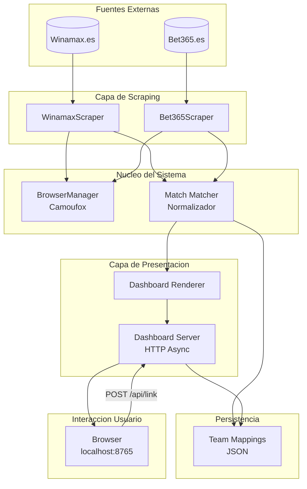

# Bethurtadom


Sistema de monitorizacion en tiempo real para deteccion de discrepancias de cuotas en apuestas deportivas en vivo. Sincroniza y normaliza datos de multiples casas de apuestas (Winamax, Bet365) para identificar oportunidades de arbitraje mediante comparacion cruzada de partidos en curso.

## Caracteristicas Principales

- **Scraping Paralelo Asincrono**: Extraccion simultanea de datos de multiples bookmakers usando `asyncio` y Playwright
- **Normalizacion Inteligente de Equipos**: Sistema de mapeo automatico y manual para unificar nombres de equipos entre distintas plataformas
- **Dashboard en Tiempo Real**: Interfaz web con auto-refresh que muestra partidos enlazados y pendientes de emparejar
- **Arquitectura Extensible**: Patron Abstract Scraper permite anadir nuevas casas de apuestas sin modificar el nucleo
- **Anti-Deteccion con Camoufox**: Navegador especializado para evitar bloqueos de bots en sitios protegidos
- **API HTTP Local**: Endpoint REST para enlazar partidos manualmente desde la UI

## Stack Tecnologico

| Categoria | Herramienta |
|-----------|-------------|
| Lenguaje | Python 3.14 |
| Automatizacion Browser | Playwright + Camoufox |
| Validacion de Datos | Pydantic 2.10+ |
| Concurrencia | Asyncio |
| Logging | Structlog |
| Linting/Formatting | Ruff |
| Testing | Pytest-asyncio |
| Frontend | HTML/CSS/JS (minimal) |

## Decisiones Tecnicas / Arquitectura

Este proyecto implementa una arquitectura **event-driven** optimizada para scraping de baja latencia. La eleccion de `asyncio` permite ejecutar scrapers de Winamax y Bet365 en paralelo sin bloquear el hilo principal, mientras que el dashboard HTTP se sirve desde el mismo proceso mediante un servidor asincrono integrado. La abstraccion `BaseScraper` (patron Strategy) desacopla la logica de scraping de cada bookmaker, facilitando la extension a nuevas plataformas. El uso de **Camoufox** resuelve el desafio tecnico de los sitios con proteccion anti-bot, combinando huellas de browser realisticas con humanizacion de interacciones.



## Instalacion (Getting Started)

### Prerrequisitos

- Python 3.14+
- Credenciales de las casas de apuestas (opcionales, para partidos que requieren login)

### Pasos

```bash
# 1. Clonar el repositorio
git clone https://github.com/samuelhm/bethurtadom.git
cd bethurtadom

# 2. Crear entorno virtual
python -m venv .venv
source .venv/bin/activate  # Linux/macOS
# .venv\Scripts\activate   # Windows

# 3. Instalar dependencias
pip install -e .

# 4. Instalar navegadores de Playwright
playwright install

# 5. Configurar variables de entorno (opcional)
cp .env.example .env
# Editar .env con las credenciales

# 6. Ejecutar el monitor
python main.py
```

### Comandos de Desarrollo

```bash
# Ejecutar tests
pytest

# Linting y formateo
ruff check .
ruff format .
```

## Estructura del Proyecto

```
bethurtadom/
├── main.py                 # Punto de entrada principal
├── src/
│   ├── core/               # Nucleo: browser, logger, settings
│   ├── engine/             # Logica de negocio: normalizador
│   ├── models/             # Modelos Pydantic
│   ├── scrapers/           # Implementaciones por bookmaker
│   │   ├── base.py         # Interfaz abstracta
│   │   ├── winamax/
│   │   └── bet365/
│   └── ui/                  # Dashboard HTML/JS
├── tests/
├── pyproject.toml          # Dependencias y configuracion
└── .env                    # Variables de entorno (no versionado)
```

## Contacto

[](https://github.com/samuelhm/)
[](https://www.linkedin.com/in/shurtado-m/)